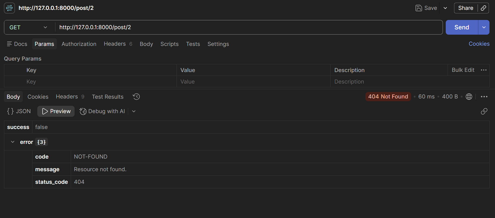
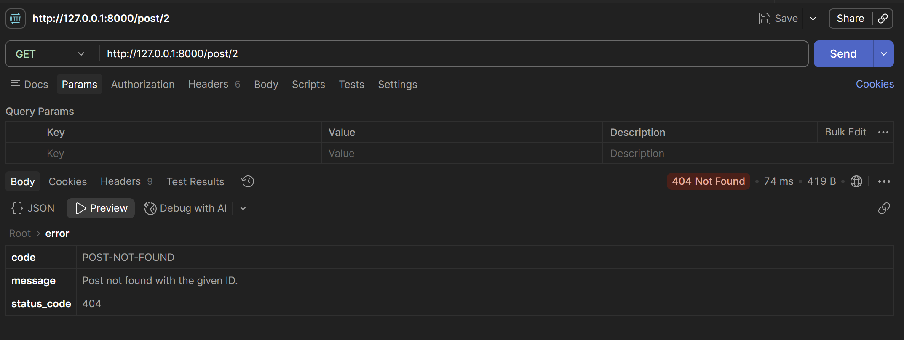
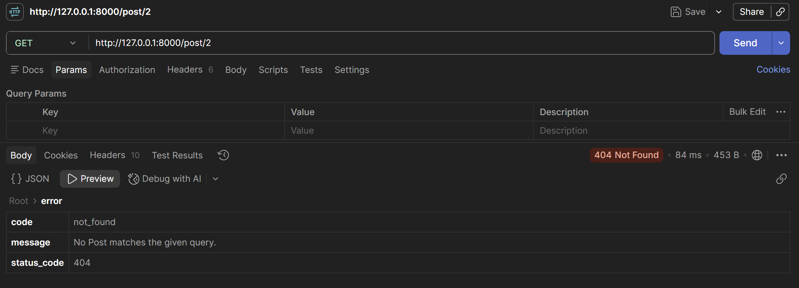
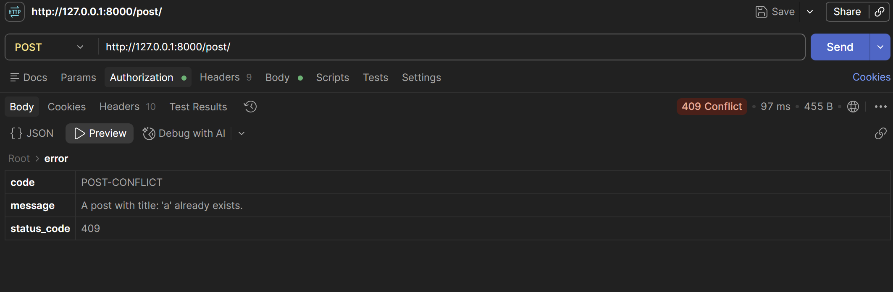

  

## About Me
Major in Software at Chung-Ang University   
Birth : 2002.04.10  
Blog : [velog](https://velog.io/@sangwon5579/posts)  

## Github

## Contact
Email : chpsangwon5579@gmail.com  
Github : [sangwon5579](https://github.com/sangwon5579)

---
과제 1-1   

과제 1-2  

과제 1-3  

과제 1-4  
